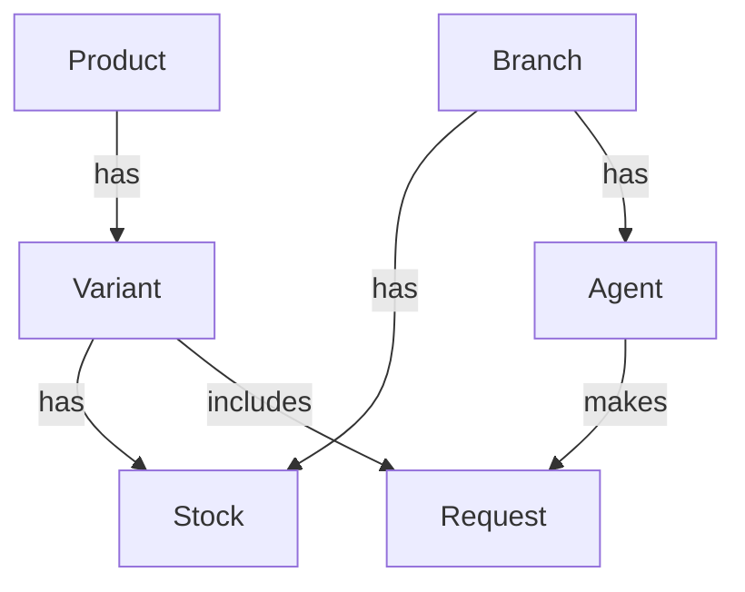
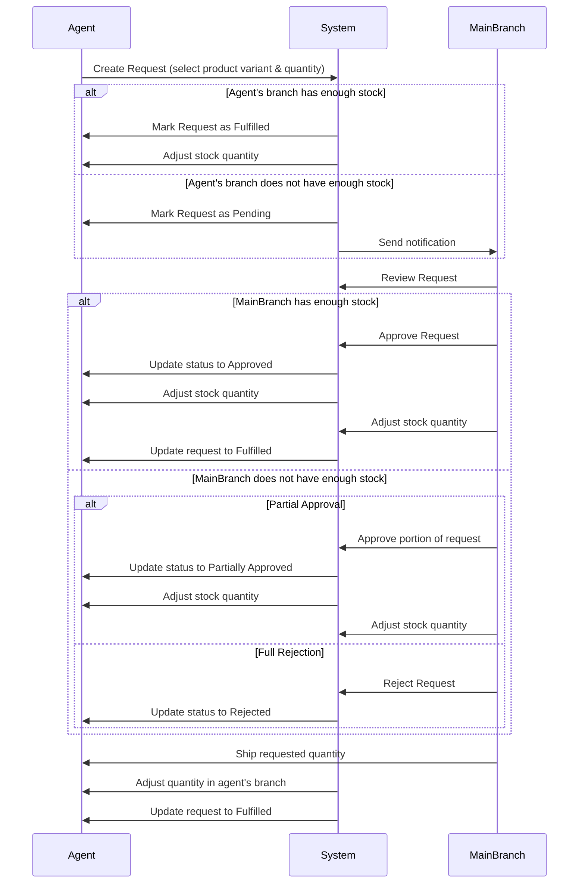

```mermaid
graph TD
    Product[Product] -->|has| Variant[Variant]
    Variant -->|has| Stock[Stock]
    Branch[Branch] -->|has| Stock
    Branch -->|has| Agent[Agent]
    Agent -->|makes| Request[Request]
    Variant -->|includes| Request
```

```mermaid

sequenceDiagram
    participant Agent
    participant System
    participant MainBranch

    Agent->>System: Create Request (select product variant & quantity)
    alt Agent's branch has enough stock
        System->>Agent: Mark Request as Fulfilled
        System->>Agent: Adjust stock quantity
    else Agent's branch does not have enough stock
        System->>Agent: Mark Request as Pending
        System->>MainBranch: Send notification
    end
    
    MainBranch->>System: Review Request
    alt MainBranch has enough stock
        MainBranch->>System: Approve Request
        System->>Agent: Update status to Approved
        System->>Agent: Adjust stock quantity
        MainBranch->>System: Adjust stock quantity
        System->>Agent: Update request to Fulfilled
    else MainBranch does not have enough stock
        alt Partial Approval
            MainBranch->>System: Approve portion of request
            System->>Agent: Update status to Partially Approved
            System->>Agent: Adjust stock quantity
            MainBranch->>System: Adjust stock quantity
        else Full Rejection
            MainBranch->>System: Reject Request
            System->>Agent: Update status to Rejected
        end
    end
    
    MainBranch->>Agent: Ship requested quantity
    System->>Agent: Adjust quantity in agent's branch
    System->>Agent: Update request to Fulfilled

```