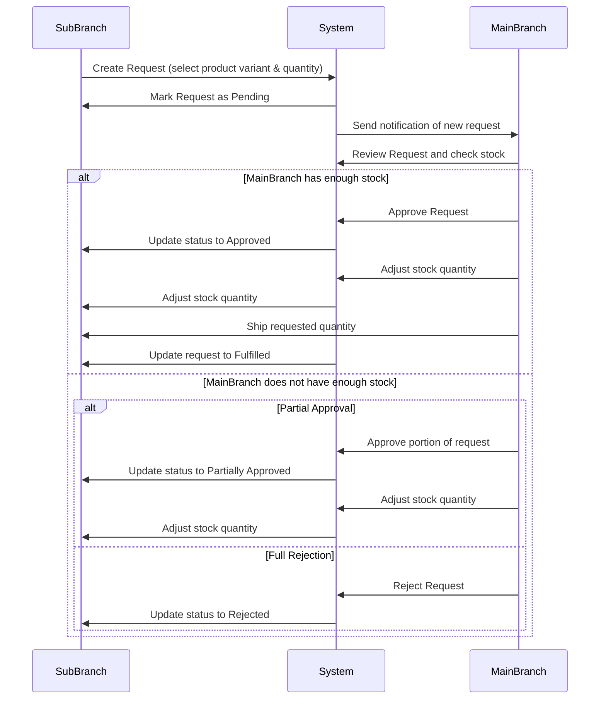

```mermaid
sequenceDiagram
    participant SubBranch
    participant System
    participant MainBranch

    SubBranch->>System: Create Request (select product variant & quantity)
    System->>SubBranch: Mark Request as Pending
    System->>MainBranch: Send notification of new request
    
    MainBranch->>System: Review Request and check stock
    alt MainBranch has enough stock
        MainBranch->>System: Approve Request
        System->>SubBranch: Update status to Approved
        MainBranch->>System: Adjust stock quantity
        System->>SubBranch: Adjust stock quantity
        MainBranch->>SubBranch: Ship requested quantity
        System->>SubBranch: Update request to Fulfilled
    else MainBranch does not have enough stock
        alt Partial Approval
            MainBranch->>System: Approve portion of request
            System->>SubBranch: Update status to Partially Approved
            MainBranch->>System: Adjust stock quantity
            System->>SubBranch: Adjust stock quantity
        else Full Rejection
            MainBranch->>System: Reject Request
            System->>SubBranch: Update status to Rejected
        end
    end


```