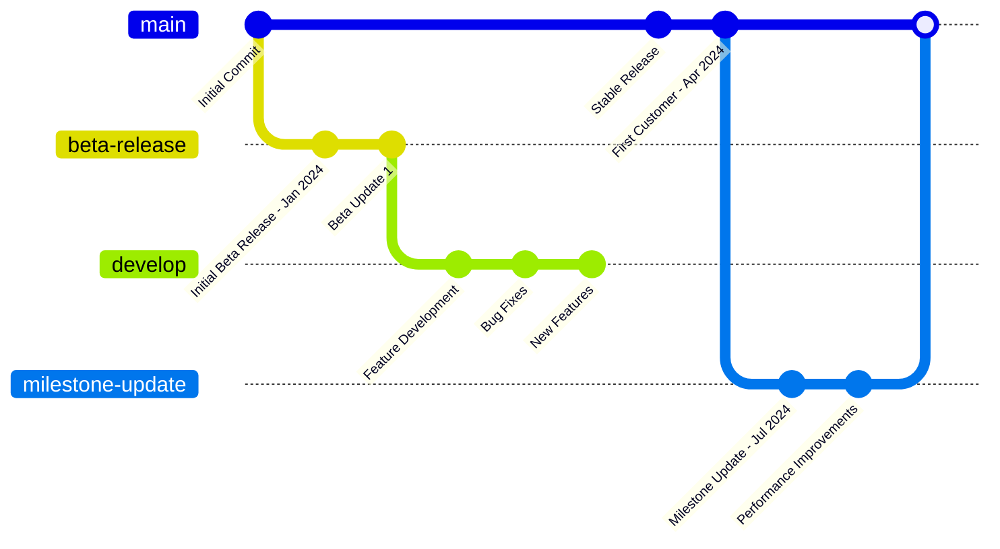

```mermaid
    gitGraph
    commit id: "Initial Commit"
    branch beta-release
    commit id: "Initial Beta Release - Jan 2024"
    commit id: "Beta Update 1"
    branch develop
    commit id: "Feature Development"
    commit id: "Bug Fixes"
    commit id: "New Features"
    checkout main
    commit id: "Stable Release"
    commit id: "First Customer - Apr 2024"
    branch milestone-update
    commit id: "Milestone Update - Jul 2024"
    commit id: "Performance Improvements"
    checkout main
    merge milestone-update

```

